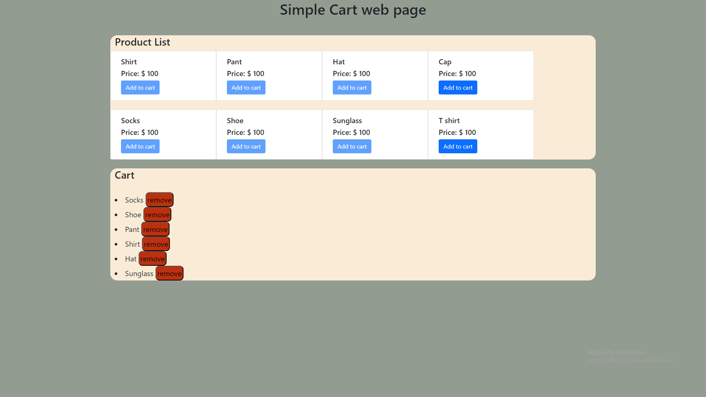

# Cart page using JS
A simple cart page where you can add items to the cart and remove items from the cart.

# Details
In this webpage we can add certain product from list to cart. We can't add same item multiple times in cart and each items in cart section assigned with a "remove" button that remove the product from cart section. 

# Live server 
- You will find the live server link [here](https://uthsasaha20000.github.io/Simple-Cart-page-using-java-script/) 

# Features
- Add items to the cart
- Remove items from the cart

# Preview 

How to create a markdown file

- You will get some resources to create markdown files below
    - [**Short video**](https://youtu.be/bpdvNwvEeSE?si=hEx8te613_ZZa1u-)
    - [Long  video](https://youtu.be/FEa2diI2qgA?si=3DZYSaYUrQtldm0D)

- You can always find more such resources if you [search](https://www.youtube.com/results?search_query=markdown+file) on Youtube

